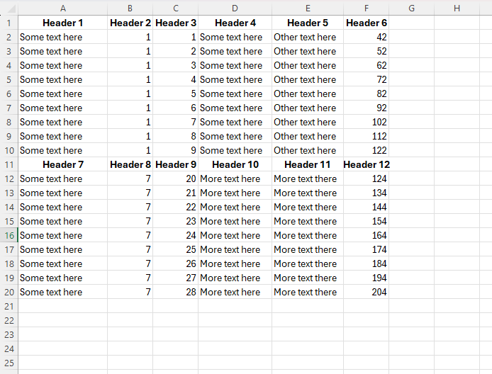

# Azure Document Intelligence - Extract information from Excel
   
This repository provides a Python script that uses Azure Document Intelligence (ADI) to extract data from Excel files and convert it into JSON format. The script processes all Excel files in the `input_documents` directory and saves the extracted data as JSON files in the `content_json` directory.  
   
## Table of Contents  
   
- [Overview](#overview)  
- [Prerequisites](#prerequisites)  
- [Getting Started](#getting-started)  
  - [Clone the Repository](#clone-the-repository)  
  - [Set Up Environment Variables](#set-up-environment-variables)  
  - [Install Dependencies](#install-dependencies)  
  - [Prepare Input Files](#prepare-input-files)  
  - [Run the Script](#run-the-script)  
- [Directory Structure](#directory-structure)  
- [How the Script Works](#how-the-script-works)  
- [Troubleshooting](#troubleshooting)  
- [Contributions](#contributions)  
- [License](#license)  
   
## Overview  
   
The script performs the following tasks:  
   
- Reads Excel files from the `input_documents` directory.  
- Sends each file to the Azure Document Intelligence API using the `prebuilt-layout` model.  
- Polls the API until the processing is complete.  
- Saves the extracted data as JSON in the `content_json` directory.  
   
## Prerequisites  
   
- **Python 3.6 or higher**: Ensure that Python is installed on your system.  
- **Azure Account**: An Azure account with access to the Azure Document Intelligence service.  
- **ADI Endpoint and API Key**: Obtain your Azure Document Intelligence endpoint and API key from the Azure portal.  
   
## Getting Started  
   
### Clone the Repository  
   
Clone the repository to your local machine:  
   
```bash  
git clone https://github.com/yourusername/repo_Azure_Document_Intelligence_Extract_Excel.git  
cd repo_Azure_Document_Intelligence_Extract_Excel  
```  
   
### Set Up Environment Variables  
   
Create a `.env` file in the root directory of the project with the following content:  
   
```dotenv  
ADI_ENDPOINT=your_adi_endpoint  
ADI_API_KEY=your_adi_api_key  
```  
   
Replace `your_adi_endpoint` and `your_adi_api_key` with your actual Azure Document Intelligence endpoint and API key. 
   
### Prepare Input Files  
   
Place the Excel files you want to process in the `input_documents` directory. An example file `test_adi_table.xlsx` is included.  

In this example, we are using the following test data.


   
### Run the Script  
   
Execute the Python script:  
   
```bash  
python 1_excel_to_json.py  
```  
   
The script will process each Excel file in the `input_documents` directory. The extracted JSON data will be saved in the `content_json` directory with the same base filename.  
   
## Directory Structure  
   
```  
repo_Azure_Document_Intelligence_Extract_Excel  
├── .env  
├── 1_excel_to_json.py  
├── content_json  
│   └── test_adi_table.json  
├── input_documents  
│   └── test_adi_table.xlsx  
```  
   
- `.env`: Contains environment variables (`ADI_ENDPOINT` and `ADI_API_KEY`).  
- `1_excel_to_json.py`: Main script that processes Excel files and extracts data using ADI.  
- `content_json`: Directory where the extracted JSON files are saved.  
- `input_documents`: Directory containing the Excel files to be processed.  
   
## How the Script Works  
   
1. **Load Environment Variables**  
  
   The script uses the `dotenv` package to load `ADI_ENDPOINT` and `ADI_API_KEY` from the `.env` file.  
  
   ```python  
   from dotenv import load_dotenv  
   load_dotenv()  
   adi_endpoint = os.getenv("ADI_ENDPOINT")  
   adi_api_key = os.getenv("ADI_API_KEY")  
   ```  
   
2. **Set Up Headers and Endpoint**  
  
   Defines the headers required for the API request, including the content type and subscription key.  
  
   ```python  
   headers = {  
       "Content-Type": "application/vnd.openxmlformats-officedocument.spreadsheetml.sheet",  
       "Ocp-Apim-Subscription-Key": adi_api_key,  
   }  
   ```  
   
3. **Define the `call_api` Function**  
  
   - **Send the Document for Processing**  
  
     Sends the Excel file to the ADI API endpoint.  
  
     ```python  
     response = requests.post(url, headers=headers, data=document_data)  
     ```  
  
   - **Poll for the Result**  
  
     If the initial response status is `202 Accepted`, the script retrieves the `Operation-Location` header, which contains the URL to check the processing status. It then polls this URL until the processing status is `succeeded` or `failed`.  
  
     ```python  
     result_url = response.headers["Operation-Location"]  
     while True:  
         result_response = requests.get(result_url, headers={"Ocp-Apim-Subscription-Key": adi_api_key})  
         # Check status and act accordingly  
     ```  
  
   - **Handle the Result**  
  
     Once the processing is `succeeded`, the script saves the result to a JSON file.  
  
     ```python  
     with open(extracted_text_file_path, "w") as json_file:  
         json.dump(result_data, json_file, indent=2)  
     ```  
   
4. **Process Each File**  
  
   The `main` function iterates over all files in the `input_documents` directory and processes them using `call_api`.  
  
   ```python  
   def main():  
       # ... setup code ...  
       for document_file in document_files:  
           # Process each file  
           call_api(document_file, json_output_path)  
   ```  
   
## Troubleshooting  
   
- **No Files Found in `input_documents`**  
  
  Ensure that the `input_documents` directory exists and contains Excel files. The script looks for all files in this directory.  
   
- **Invalid ADI Endpoint or API Key**  
  
  Verify that the `ADI_ENDPOINT` and `ADI_API_KEY` in your `.env` file are correct. Ensure there are no extra spaces or invisible characters.  
   
- **API Errors**  
  
  If the script fails to start processing the document or if the processing status is `failed`, check the console output for error messages. Common issues include exceeding quota limits or unsupported file formats.  
   

   
## License  
   
This project is licensed under the [MIT License](LICENSE).  
   
